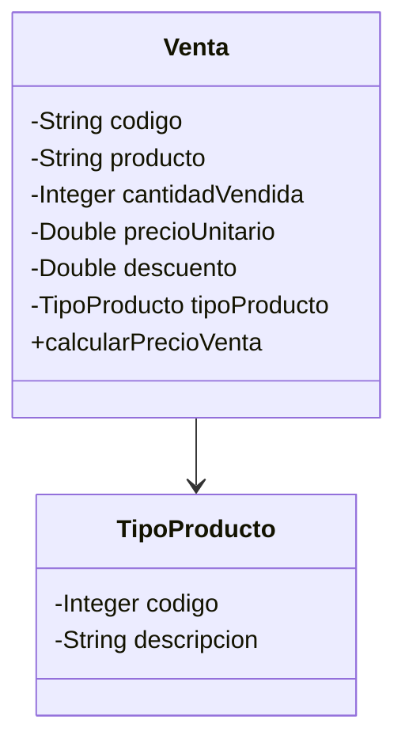

# Enunciado de Practica Colecciones, Streams y otras yerbas

## Consideraciones generales
El presente documento tiene un paso a paso que lleva desde la creacion de clases simples sin utilizar herencia, zafaron de eso, pero aca viene otra maldad de toda maldad `😈`. Primero pongamos contexto y despues vamos a los "items" a desarrollar.

### Eunciado

Una Cafeteria necesita un programa que permita realizar una serie de estadisticas, para eso se va a contar con un estructura simple de objetos que estara representada en un archivo csv llamado [cafelahumedad](cafelahumedad.csv). Cada fila del csv va a producir objetos de la siguiente estructura, muy simple por cierto:


### Paso a paso

Vale usar todos los conocimiento hasta ahora y si quieren renegar con IA pues adelante (seria piola que no, renegar para aprender es el objetivo)

1. Crear un proyecto en JAVA usando Maven, pueden ejecutar el siguiente comando.
    > mvn archetype:generate "-DgroupId=com.frc.isi.csv.colecciones.app" "-DartifactId=csv-colecciones-app" "-Dversion=1.0-SNAPSHOT" "-DarchetypeGroupId=org.apache.maven.archetypes" "-DarchetypeArtifactId=maven-archetype-quickstart" "-DarchetypeVersion=1.5"

2. Modificar el archivo pom.xml colcando la dependencia de lombok y que se pueda ejecutar sin necesdad de indicar la ubicacion de la clase App. Les paso lo necesario 
    ```xml
    <dependency>
        <groupId>org.projectlombok</groupId>
            <artifactId>lombok</artifactId>
        <version>1.18.38</version>
    </dependency>
    ```

    ```xml
        <plugin>
          <groupId>org.codehaus.mojo</groupId>
          <artifactId>exec-maven-plugin</artifactId>
          <version>3.5.0</version>
          <configuration>
            <mainClass>com.frc.isi.csvstream.app.App</mainClass>
          </configuration>
        </plugin>
    ```
3. En la carpeta practica del proyecto crear una nueva carpeta llamada resources, dentro compiar este enunciado y crear un subfolder llamado data y dentro de esta carpeta pegar el archivo csv

 __Hasta aca facil y sencillo, a embarrarla__ `😈`

 4. Vamos a crear un Interfaz Funcional llamada OpcionDeMenu, que sea generica y que por regla tenga el metodo ejecutar que reciba como parametro un contexto (una instancia del objeto que contendra todas las Ventas)
 5. Vamos a crear un clase llama Menu con las siguiente consideraciones
    1. Crear una interfaz que llame IMenu que permita menejar Generics y tenga los siguientes comportamientos
        > void registrarOpcion(int opcion, String textoAMostrar, OpcionDeMenu\<T\> action)

        > void invocarAction(T contexto, Scanner lector);
    2. La clase contendra la sigiuente definicion, obviamente manejara Generics como la interfaz y obviamente implementar los metodos de la interfaz IMenu
        > public class Menu\<T\> implements IMenu\<T\>
    3. La clase tendra un unico atributo, una coleccion de tipo __Map__ llamada acciones, idexada por un entero y contendra una instancia de OpcionDeMenu\<T\>
    4. _registrarOpcion_ agrena un elemento a la coleccion
    5. _invocarAccion_ mostrara el menu de opciones. Pista: visualicen el menu y lo pueden hacer usando keySet... sino pueden llevar una coleccion con las opcines, aca tienen la clase.
        ```java
            @Data
            @AllArgsConstructor
            public class ItemMenu {
                private int codigo;
                private String descripcion;

                @Override
                public String toString() {
                    return this.codigo + " ---------------- " + this.descripcion;

                }
            }
        ```
    A partir de alli, visulizan el menu de opciones, leen con Scanner la opcion, la buscan y si existe invocan la FunctionalInterface.
1. Ahora vamos a los bifes, cumplir el enunciado agregando opciones de menu je
   1. Importar el csv, abrir el archivo que esta dentro del folder, asumiendo que puede haber mas de un archivo csv. Deben ver donde ubicar este comportamiento, __pista: Una clase que contenga la/s colecciones__. Se puede mapear el folder para la lectura de la siguiente manera
        > URL folderPath = App.class.getResource("./resources/data");
      1. Al importar el csv el Tipo de Producto se puede repetir, por lo cual no agregar duplicados del TipoDeProducto, __pista: Map__ y el codigo del tipo de producto es incremental auto generado por el codigo
   2. Mostrar todas la Ventas, como sale del toString, ordenado por nombre del producto, al final mostar la cantidad total vendida y el total recaudado (la suma de los resultados calcularPrecioVenta) 
   3. Informar todos los productos cuyo precio de Venta sea mayor al promedio del pecio de venta
   4. Informar todos los productos para un tipo de producto cuya cantidad se mayor a la menor cantidad de productos vendidos
   5. Deben informar el nombre del tipo de producto y cuanto se vendio en total por ese tipo de producto, ordenado por total vendido de mayor a menor.
   6. Generar un informe ordenado por codigo, mostrando todos los datos de la venta,  cuyo descuento sea mayor al 1%, Usen partitioningBy

A divertirse... y renegar que es la unica manera de aprender

### Opcional: conectar a GitLab para guardarlo
1. Crear en GitLab, cuando tengan acceso, un proyecto vacio, no lo inicialicen con el archivo readme
2. En una terminal de VS Code correr el sigiuente comando:
    > git init
3. Luego crear el branch main, para evitar complicaciones
    > git switch --create main
4. Asociar el repo local con el remoto que crearon en GitLab
    > git remote add origin [url del repo]
   