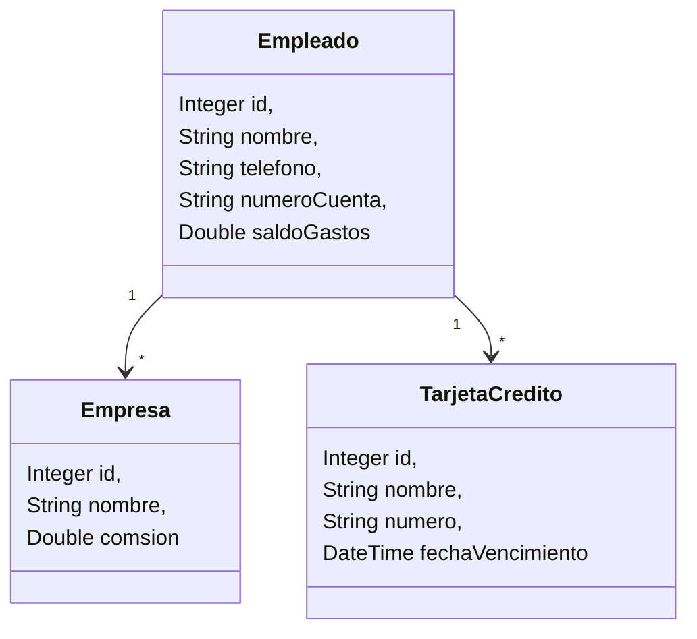

# Enunciado Fintech Base de Datos Stream y otras yerbas

## Propósito

El Enunciado tiene el objetivo de plantear la realización de un ejercicio que plantee como hacer un mapeo de objectos de entidad para tener una conexion a un repositorio de tipo relacional externo, y a partir del mismo realizar un serie de puntos que permitan procesar la información guardada en la base de datos.
Todo se hara a parti de un csv y se les presentará un repositorio para que podamos trabajar

## Pasos a Segir

1. Clonar el repositorio para poder trabajar...

   > poner aca la url del repo

2. Si quiere hacer todo de cero, seguir estos pasos
   1. Ejecutar el siguiente comando maven
    
    > mvn archetype:generate "-DgroupId=com.frc.isi.fintech.app" "-DartifactId=fintech-app" "-Dversion=1.0-SNAPSHOT" "-DarchetypeGroupId=org.apache.maven.archetypes" "-DarchetypeArtifactId=maven-archetype-quickstart" "-DarchetypeVersion=1.5"

3. Crear el repositorio en forma local creando el branch main
   
   > git init --initial-branch=main

4. Asocie su repo local con el repo remoto que usted creó, es importante que lo cree vacío sin incializar el repositorio con el README.md. 

   > git remote add origin [YOUR_URL]

5. A su proyecto creado en VS Code el archivo .gitignore con el siguiente contenido

   ```gitignore
   # Compiled class files
   *.class

   # Log files
   *.log

   # BlueJ files
   *.ctxt

   # Mobile Tools for Java (J2ME)
   .mtj.tmp/

   # Package Files #
   *.jar
   *.war
   *.nar
   *.ear
   *.zip
   *.tar.gz
   *.rar

   # Virtual machine crash logs
   hs_err_pid*
   target/
   ```

6. En la carpeta __resources__ crea la carpeta __META_INF__ dentro cree un archivo _persistence.xml_ con esta estructura que luego se completará

   ```xml
   <?xml version="1.0" encoding="UTF-8"?>
   <persistence xmlns="https://jakarta.ee/xml/ns/persistence"
      xmlns:xsi="http://www.w3.org/2001/XMLSchema-instance"
      xsi:schemaLocation="https://jakarta.ee/xml/ns/persistence https://jakarta.ee/xml/ns/persistence/persistence_3_0.xsd"
      version="3.0">

      <persistence-unit name="" transaction-type="RESOURCE_LOCAL">
         <!-- Your entity classes -->
         
         <properties>
               <!-- JDBC connection -->
               <property name="jakarta.persistence.jdbc.driver" value="org.h2.Driver" />
               <property name="jakarta.persistence.jdbc.url"
                  value="jdbc:h2:file:./data/fintech.mv.db" />
               <property name="jakarta.persistence.jdbc.user" value="sa" />
               <property name="jakarta.persistence.jdbc.password" value="" />

               <!-- Hibernate as JPA provider -->
               <property name="hibernate.dialect" value="org.hibernate.dialect.H2Dialect" />
               <property name="hibernate.hbm2ddl.auto" value="update" /> <!-- create | create-drop |
               update | validate -->
               <property name="hibernate.show_sql" value="true" />
               <property name="hibernate.format_sql" value="true" />
         </properties>
      </persistence-unit>
   </persistence>
   ```

7. Agregue a archivo __pom.xml__ las siguientes dependencias

   ```xml
      <dependency>
        <groupId>org.projectlombok</groupId>
        <artifactId>lombok</artifactId>
        <version>1.18.38</version>
      </dependency>
      <dependency>
        <groupId>com.h2database</groupId>
        <artifactId>h2</artifactId>
        <version>2.3.232</version>
      </dependency>
      <dependency>
        <groupId>org.hibernate</groupId>
        <artifactId>hibernate-core</artifactId>
        <version>7.0.2.Final</version>
      </dependency>
      <dependency>
        <groupId>io.ebean</groupId>
        <artifactId>jakarta-persistence-api</artifactId>
        <version>3.1</version>
      </dependency>
   ```

8. Resuelva el enunciado

## Enunciado

Una empresa Fintech que prevee servicios financiaros a empresa para los gastos de sus empleados alrededor del mundo necesita un programa que permita obtener una serie de estadisticas e informes sobre la operatoria de la empresa. Para ello nos presenta con un diagrama de clase sencillo para su resolucion. Cabe aclarar que la informacion que se usará estara presente en un archivo csv. Para simplificación del proceso la empresa no provee todo saldo en dólares.


En base a este diagrama resolver los siguientes puntos:
1. Importar a la base de datos el archivo csv, respetando las siguientes consideraciones del caso
   1. El nombre de la empresa aparece en repetidas lineas, pero uno y solo un nombre debe ser importado a la base de datos
   2. La tarjeta de credito  el numero de la misma debe ser unica, si hay un mismo numero de tarjeta repetido se debe lanzar una excepcion
2. Una vez importado, determinar por tarjeta de credito cual es el total de gasos en los que incurrieron los empleados, mostrando el nombre de la tarjeta de credito y dicho acumulado, ordenado de menor a mayor
3. Informar para un compania x los datos de los empleaados, al final indicar en base al acumulado total de gastos cual es la comision que gano la fintech
4. Informar mostrando nombre, telefono, numero de cuenta, numero de tarjeta de todos aquellos empleados que cuya tarjeta de credito es por vencer este o el mes proximo, debe salir ordenado por el nombre del empleado
5. Informar por cada nombre de tarjeta de credito, cual es el numero de cuanta con el maximo y minimo saldo de gastos