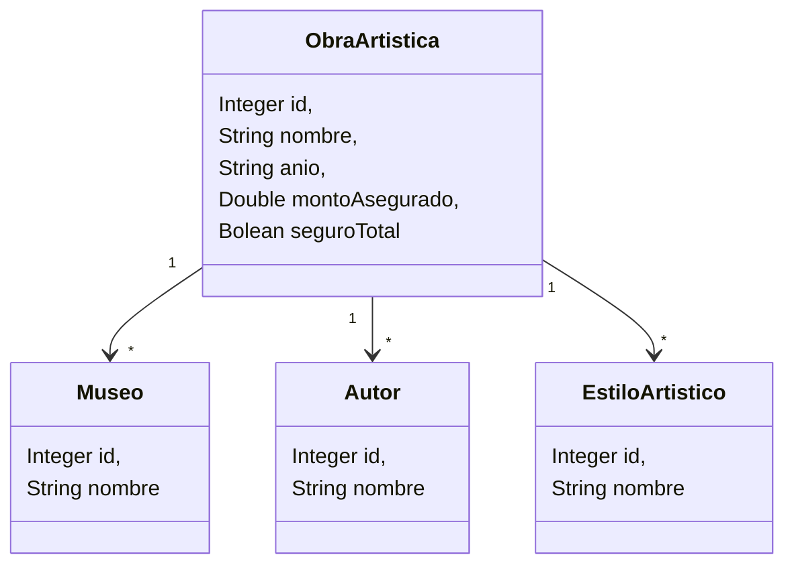

# Práctica para integrar manejo de csv, stream y base de datos

## Propósito

La idea es que a traves de un ejercicio sencillo procesando unas pocas entidades se logre importar de un csv, que genere en memoria las colecciones necesarias y a partir de alli impactar en la base de datos. Para practicar desde las colecciones se grabará a la base de datos y se realizarán queries en patrón DAO para realizar ciertos puntos del enunciado

## Enunciado

Una empresa de seguros especializada en museos necesito un programa que permita llevar un inventario de las obras que tienen en cada museo. Para ello se dispone de un archivo csv llamado obras.csv que contiene un listado de todas las obras aseguradas en los museos.

Cada linea del archivo posee la siguiente estructura:
NOMBRE_OBRA: Como se llama la obra
ANIO_CREACION: en que año fue creada
AUTOR: Quien fue el pintor que la creo
NOMBRE_MUSEO: en que museo se expone
ESTILO_ARTISTICO: a que tipo de arte pertenece
MONTO_ASEGURADO: el dinero que pagar la empresa por la destruccino total o parcial de esa obra
SEGURO_TOTAL: 1 si el seguro es por desctruccion, 0 si es daño parcial

Esto genera la siguiente estructura de objetos de entidad y por ende, tablas de las bases de datos:



Usando el archivo csv provisto en la carpeta _resources/files_, usted debera desarrollar los siguiente puntos:

1. Cargar todos los datos de todas las obras en la base de datos, asociando cada obra a los objetos necesarios y teniendo en cuenta que cada uno de los objetos asociados debe existir una y solo una vez en la memoria.

2. Determinar e informar el monto total que se debe pagar si las obras tiene un seguro por destruccion total, el monto total que se debe pagar si las obras tiene seguro por daño parcial, y el monto total asegurado por todas las obras

3. Generar un archivo de txto separado por comas con el reporte de las obras por estilo artistico. Debe contener el nombre de cada estilo y la cantidad de obras aseguradas de ese estilo.

4. Mostrar por pantalla la lista de totas las obras que tienen seguro por daño parcial y un monto superior al monto promedio asegurado. El listado debe presentarse ordenado en forma descendente por el año de creacion de la obra.

5.  Mostrar por pantalla las obras de un museo especifico, el nombre del autor de la obra, el estilo artistico.


## Pasos de configuración

1. Cree el proyecto usando maven arthifact
   
 > mvn archetype:generate "-DgroupId=com.frc.isi.museo.app" "-DartifactId=museo-obras-arte-app" "-Dversion=1.0-SNAPSHOT" "-DarchetypeGroupId=org.apache.maven.archetypes" "-DarchetypeArtifactId=maven-archetype-quickstart" "-DarchetypeVersion=1.5"

2. Cree en la carpeta _resources/META_INF_ el archivo __persitence.xml__ y pegue el siguiente contenido

```xml
<?xml version="1.0" encoding="UTF-8"?>
<persistence xmlns="https://jakarta.ee/xml/ns/persistence"
    xmlns:xsi="http://www.w3.org/2001/XMLSchema-instance"
    xsi:schemaLocation="https://jakarta.ee/xml/ns/persistence https://jakarta.ee/xml/ns/persistence/persistence_3_0.xsd"
    version="3.0">

    <persistence-unit name="museo" transaction-type="RESOURCE_LOCAL">
        <!-- Your entity classes -->
        
        <properties>
            <!-- JDBC connection -->
            <property name="jakarta.persistence.jdbc.driver" value="org.h2.Driver" />
            <property name="jakarta.persistence.jdbc.url"
                value="jdbc:h2:file:./data/museo.mv.db" />
            <property name="jakarta.persistence.jdbc.user" value="sa" />
            <property name="jakarta.persistence.jdbc.password" value="" />

            <!-- Hibernate as JPA provider -->
            <property name="hibernate.dialect" value="org.hibernate.dialect.H2Dialect" />
            <property name="hibernate.hbm2ddl.auto" value="update" /> <!-- create | create-drop |
            update | validate -->
            <property name="hibernate.show_sql" value="true" />
            <property name="hibernate.format_sql" value="true" />
        </properties>
    </persistence-unit>
</persistence>
```
3. Cree el repositorio en GitLan sin inicializar con el README.md
4. Cree su repositorio local con el branch main
   
    > git init --initial-branch=main

5. Asocie su repo local con el repo creado en el step 4
   
   > git remote add origin [YOUR_URL]

6. Agregue el .gitignore en la raiz del proyecto

```gitignore
# Compiled class files
*.class

# Log files
*.log

# BlueJ files
*.ctxt

# Mobile Tools for Java (J2ME)
.mtj.tmp/

# Package Files #
*.jar
*.war
*.nar
*.ear
*.zip
*.tar.gz
*.rar

# Virtual machine crash logs
hs_err_pid*

```

7. Reniegue y Resuelva, como cortesia las clases se las damos, el resto es de ustedes, tengan en cuenta que deberán modificar las clases para el mapeo de la base de datos
8. Haga commit y push de sus cambios para seguir en sus casa si no llegan a terminar